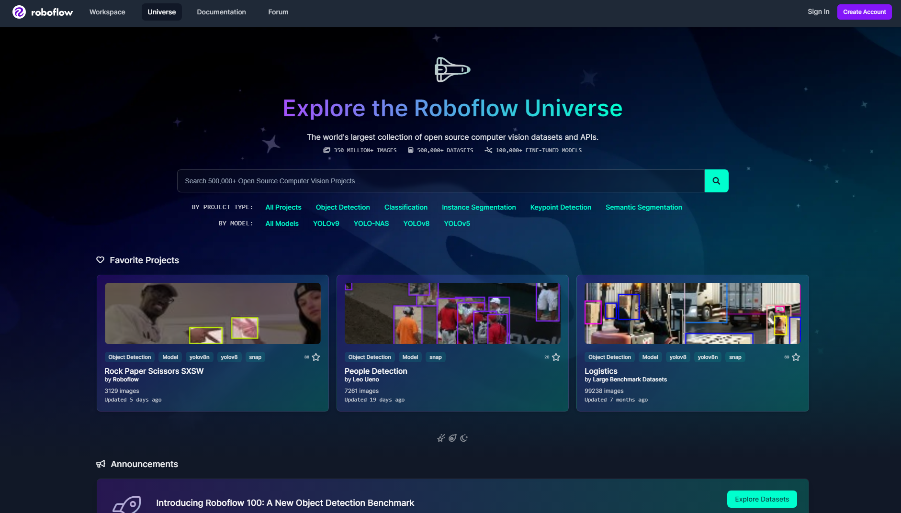
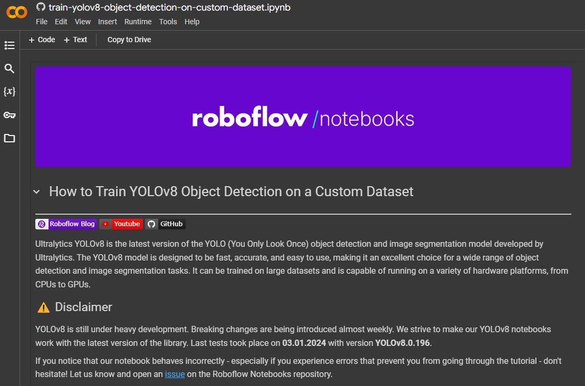

This a Computer Vision "object detection" project. I used Python 3.8 version, yolov8 (you can also use yolov5 if you want) and Opencv write this program.

In order to install the necessary dependencies we use requirements.txt file and build our Python 3.8 virtual environment. 
Just as follows:

    py -3.8 -m venv {namefyourvirtualenvironment}
    py -m pip install requirements.txt

If you happen to change or add new dependencies, you can also make your own requirements.txt file as follows:

    py -m pip freeze --local > requirements.txt

You can make your own AI model with Yolov8 official website which includes a detail tutorial on how to do it using [Yolov5](https://docs.ultralytics.com/yolov5/tutorials/train_custom_data/) or using [Yolov8](https://docs.ultralytics.com/). You can also check its proper github [documentation](https://github.com/ultralytics/ultralytics).

If you wish, you can check [Roboflow's](https://blog.roboflow.com/how-to-train-yolov8-on-a-custom-dataset/) documentation also, and explore its open source computer vision datasets and APIs [here](https://universe.roboflow.com/).

I personally used a custom dataset [notebook](https://colab.research.google.com/github/roboflow-ai/notebooks/blob/main/notebooks/train-yolov8-object-detection-on-custom-dataset.ipynb#scrollTo=oe9vkEvFABbN) from Roboflow.

